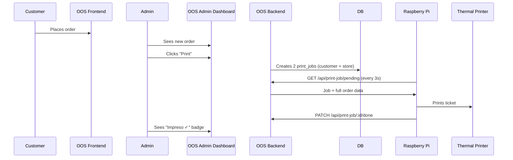

# OOS + hello-printer Merge Plan

> [!abstract] Goal
> Wire the online ordering system (OOS) to the thermal printer (hello-printer) so the admin can print 2 physical tickets per order (COPIA CLIENTE + COPIA TIENDA) during a live demo.

---

## Projects Overview

| Project | Path | Port | DB |
|---------|------|------|----|
| OOS (ordering) | `/oos` | 3000 | `oos_db` |
| hello-printer | `/hello-printer` | 3001 (unused after merge) | `hp_db` (unused after merge) |

> [!info] Architecture Decision
> The hello-printer **backend is absorbed into OOS**. The Raspberry Pi Python scripts are updated to point to port 3000. The hello-printer backend/DB become unused but are left intact.

---

## Demo Flow



---

## Files to CREATE

### `oos/backend/models/printJobModel.js`

Four functions:

- **`createJobsForOrder(orderId)`** — inserts 2 rows (`customer` + `store`). Idempotent (skips if already exists).
- **`createJobsForRecentOrders(minutes)`** — finds orders in last N minutes with no print jobs, creates 2 jobs each.
- **`getPendingJob()`** — returns oldest pending job **with full order data** (JOIN across orders + order_items + products).
- **`markJobDone(id)`** — sets `status='done'`, `printed_at=NOW()`.

> [!important] Key SQL — `getPendingJob()`
> Uses `json_agg` to return items array in a single query. Returns: `id`, `order_id`, `copy_type`, `customer_name`, `order_date`, `items[]`

### `oos/backend/routes/printJobRoutes.js`

All routes protected with `authenticateToken`:

| Method | Route | Purpose |
|--------|-------|---------|
| `POST` | `/api/print-job/order/:id` | Print 1 order (2 copies) |
| `POST` | `/api/print-job/recent` | Print all unprinted orders in last 30 min |
| `GET` | `/api/print-job/pending` | Get next pending job (Raspberry Pi) |
| `PATCH` | `/api/print-job/:id/done` | Mark job done (Raspberry Pi) |

---

## Files to MODIFY

### `oos/database/init.sql`

Append at end:

```sql
CREATE TABLE IF NOT EXISTS print_jobs (
    id          SERIAL PRIMARY KEY,
    order_id    INTEGER NOT NULL REFERENCES orders(order_id) ON DELETE CASCADE,
    copy_type   VARCHAR(10) NOT NULL CHECK (copy_type IN ('customer', 'store')),
    status      VARCHAR(20) DEFAULT 'pending' CHECK (status IN ('pending', 'done')),
    created_at  TIMESTAMP DEFAULT CURRENT_TIMESTAMP,
    printed_at  TIMESTAMP DEFAULT NULL
);
```

### `oos/backend/server.js`

Add after existing route mounts:

```js
const printJobRoutes = require('./routes/printJobRoutes');
app.use('/api/print-job', printJobRoutes);
```

Also update the 404 route list and startup log to include new routes.

### `oos/backend/models/orderModel.js` — `getAllOrders()`

Add `has_print_jobs` boolean via LEFT JOIN:

```sql
SELECT o.order_id, o.customer_name, o.customer_phone, o.customer_email,
       o.order_date, o.total_amount, o.status,
       CASE WHEN COUNT(pj.id) > 0 THEN true ELSE false END AS has_print_jobs
FROM orders o
LEFT JOIN print_jobs pj ON pj.order_id = o.order_id
-- WHERE clause stays the same
GROUP BY o.order_id, o.customer_name, o.customer_phone, o.customer_email,
         o.order_date, o.total_amount, o.status
ORDER BY o.order_date DESC
```

### `oos/backend/middleware/validateTime.js`

Replace hardcoded hours with env vars:

```js
const startHour = parseInt(process.env.ORDER_HOUR_START) || 6;
const endHour   = parseInt(process.env.ORDER_HOUR_END)   || 18;
if (currentHour < startHour || currentHour >= endHour) { ... }
```

Fix the error message to show actual configured hours dynamically.

### `oos/backend/.env`

Add:

```
ORDER_HOUR_START=4
ORDER_HOUR_END=23
RECENT_ORDER_MINUTES=30
```

### `oos/frontend/admin/index.html`

- Add `"Imprimir Recientes (30 min)"` button near the filter buttons in the header area.

### `oos/frontend/admin/script.js`

- Add `printedOrders` Set (populated from `has_print_jobs` on orders load).
- In `createOrderCard()`: add Print button + `"Impreso ✓"` badge.
- Add `printOrder(orderId)` → `POST /api/print-job/order/${orderId}`.
- Add `printRecentOrders()` → `POST /api/print-job/recent`.
- Reuse existing `showToast()` and `getAuthToken()`.

### `hello-printer/files/poll_and_print.py`

Update `print_job(job)` to use real data:

```python
def print_job(job):
    order = {
        **STORE,
        'order_id'  : job['order_id'],
        'customer'  : job['customer_name'],
        'timestamp' : datetime.fromisoformat(job['order_date']),
        'copy_type' : job['copy_type'],
        'items'     : [
            {'name': i['name'], 'qty': i['qty'], 'price': i['price']}
            for i in job['items']
        ],
    }
    with open(DEVICE, 'wb') as p:
        build_ticket(p, order)
```

> [!note] Pi `.env` update
> Change `API_URL` to point to OOS port 3000 (or 8080 via nginx) instead of 3001.

### `hello-printer/files/ticket.py`

Add copy label at top of ticket, right after `w(RESET)`:

```python
label = 'COPIA CLIENTE' if order.get('copy_type') == 'customer' else 'COPIA TIENDA'
w(DOUBLE_SIZE_ON)
w(center(label))
w(DOUBLE_SIZE_OFF)
```

---

## Execution Order (Checklist)

- [ ] `oos/database/init.sql` — add `print_jobs` table
- [ ] `oos/backend/models/printJobModel.js` — create new file
- [ ] `oos/backend/routes/printJobRoutes.js` — create new file
- [ ] `oos/backend/server.js` — mount routes
- [ ] `oos/backend/models/orderModel.js` — add `has_print_jobs` to `getAllOrders`
- [ ] `oos/backend/middleware/validateTime.js` — use env vars
- [ ] `oos/backend/.env` — add new vars
- [ ] `oos/frontend/admin/index.html` — add Print Recent button
- [ ] `oos/frontend/admin/script.js` — print functions + indicators
- [ ] `hello-printer/files/poll_and_print.py` — real order data
- [ ] `hello-printer/files/ticket.py` — copy label

---

## What is NOT Changed

- Customer ordering page (`/frontend/customer/`)
- Auth system (JWT, same secret, same routes)
- hello-printer backend & docker-compose (kept intact, just unused)
- Product routes
- ESC/POS commands or printer device path (`/dev/usb/lp0`)

---

## Verification Steps

1. `docker-compose up` in `oos/database/` → `print_jobs` table auto-created
2. `npm run dev` in `oos/backend/` → new routes visible in startup log
3. Browse customer page → place a test order
4. Log into admin → see order with Print button
5. Click Print → toast: `"2 trabajos creados"`
6. On Pi: `python3 poll_and_print.py` → picks up 2 jobs, prints 2 tickets
7. Admin → order shows `"Impreso ✓"` badge
8. Click `"Imprimir Recientes (30 min)"` → queues any unprinted orders

> [!warning] DB rebuild required
> If the database was previously initialized without `print_jobs`, you need to tear it down and rebuild:
> ```bash
> docker-compose down -v
> docker-compose up -d
> ```
